# Architecture of SQL Assistant

## Overview
The SQL Assistant architecture is designed to efficiently convert natural language queries into SQL statements using a multi-agent system. The architecture leverages semantic schemas to enhance the understanding of user queries.

## System Flow Diagram

```mermaid
graph TD
    A["👤 User Input<br/>Natural Language Query"] --> B["🌐 Gradio UI<br/>Web Interface"]
    
    B --> C["🔍 Database Schema Loading<br/>get_db_schema()"]
    C --> D["📊 Semantic Schema Manager<br/>Load semantic context"]
    D --> E{"🎯 Semantic Schema<br/>Available?"}
    
    E -->|Yes| F["✅ Enhanced Schema<br/>Basic + Semantic Context"]
    E -->|No| G["📋 Basic Schema<br/>Standard DB Schema"]
    
    F --> H["🧠 Intent Parser Agent<br/>parse(user_query, schema_info)"]
    G --> H
    
    H --> I["🔧 Schema Adaptation<br/>adapt_schema_for_llm()"]
    I --> J["📝 Context Building<br/>_build_context_generic()"]
    
    J --> K["🤖 LLM Processing<br/>OpenAI GPT"]
    K --> L["📋 Intent Result<br/>JSON Structure"]
    
    L --> M["📐 SQL Planner Agent<br/>create_plan()"]
    M --> N["✅ SQL Validator Agent<br/>validate_plan()"]
    N --> O["⚙️ SQL Generator Agent<br/>generate_sql()"]
    
    O --> P["🔍 Few-Shot Examples<br/>Load cached examples"]
    P --> Q["🤖 SQL Generation LLM<br/>OpenAI GPT"]
    Q --> R["📝 Generated SQL"]
    
    R --> S["🔍 Schema Validation<br/>Validate against DB schema"]
    S --> T{"✅ SQL Valid?"}
    
    T -->|No| U["🔧 Auto-Fix Attempt<br/>Correct SQL issues"]
    U --> S
    T -->|Yes| V["🗄️ Query Execution<br/>Execute against database"]
    
    V --> W{"🚨 Execution<br/>Successful?"}
    W -->|No| X["🔄 Retry Logic<br/>Error handling"]
    X --> V
    W -->|Yes| Y["📊 Results Processing<br/>Format data"]
    
    Y --> Z["📈 Visualization Agent<br/>Create charts/graphs"]
    Z --> AA["🌐 Display Results<br/>Return to Gradio UI"]
    
    AA --> BB["👤 User Sees Results<br/>SQL + Data + Charts"]
    
    %% Styling
    classDef userNode fill:#e1f5fe,stroke:#01579b,stroke-width:2px
    classDef uiNode fill:#f3e5f5,stroke:#4a148c,stroke-width:2px
    classDef agentNode fill:#e8f5e8,stroke:#1b5e20,stroke-width:2px
    classDef llmNode fill:#fff3e0,stroke:#e65100,stroke-width:2px
    classDef dataNode fill:#fce4ec,stroke:#880e4f,stroke-width:2px
    classDef decisionNode fill:#fff8e1,stroke:#f57f17,stroke-width:2px
    
    class A,BB userNode
    class B,AA uiNode
    class H,M,N,O,Z agentNode
    class K,Q llmNode
    class C,D,F,G,I,J,L,P,R,V,Y dataNode
    class E,T,W decisionNode
```

## Detailed Flow of User Query Execution

### **Phase 1: Input & Schema Processing**
1. **User Input**: The user submits a natural language query through the Gradio UI.
2. **Schema Loading**: System loads database schema and checks for semantic schema availability.
3. **Schema Enhancement**: If semantic schema exists, it's combined with basic schema for enhanced context.

### **Phase 2: Intent Parsing**
4. **Intent Parsing**: The `IntentParserAgent` receives the user query and schema information.
5. **Schema Adaptation**: `adapt_schema_for_llm()` prepares schema context for LLM processing.
6. **Context Building**: `_build_context_generic()` constructs comprehensive context including:
   - The original user query
   - Detected column aliases
   - Semantic context from the schema
7. **LLM Processing**: OpenAI GPT processes the context to extract structured intent.

### **Phase 3: SQL Generation Pipeline**
8. **SQL Planning**: The `SQLPlannerAgent` creates an execution plan from the parsed intent.
9. **Plan Validation**: The `SQLValidatorAgent` validates the plan against schema constraints.
10. **SQL Generation**: The `SQLGeneratorAgent` generates SQL using few-shot examples and LLM.
11. **Schema Validation**: Generated SQL is validated against database schema.
12. **Auto-Fix**: If validation fails, system attempts automatic corrections.

### **Phase 4: Execution & Results**
13. **Query Execution**: Valid SQL is executed against the database with retry logic.
14. **Results Processing**: Raw data is formatted and processed.
15. **Visualization**: Charts and graphs are generated if applicable.
16. **Display**: Results are returned to user through Gradio UI.

## Critical Agents and Underlying Methods

### 1. IntentParserAgent
- **Purpose**: Converts natural language queries into structured SQL intents.
- **Key Methods**:
  - `parse(user_query, schema_info)`: Main entry point for parsing user queries.
  - `adapt_schema_for_llm(schema_info)`: Adapts the schema for LLM processing, preserving semantic context.

### 2. SQLPlannerAgent
- **Purpose**: Creates execution plans for SQL queries.
- **Key Methods**:
  - `create_plan(action, entity)`: Generates a SQL execution plan based on the action and entity provided.

### 3. SQLGeneratorAgent
- **Purpose**: Generates SQL statements from validated plans.
- **Key Methods**:
  - `generate_sql(plan)`: Converts the execution plan into a SQL statement.

### 4. SemanticSchemaManager
- **Purpose**: Manages the loading and adaptation of semantic schemas.
- **Key Methods**:
  - `load_schema(file_path)`: Loads the semantic schema from a specified file.
  - `get_combined_schema_context(semantic_schema, schema)`: Combines semantic schema with the basic schema context.

## Conclusion
The architecture of SQL Assistant is designed to provide accurate and efficient SQL generation from natural language queries, leveraging semantic understanding and multi-agent coordination.