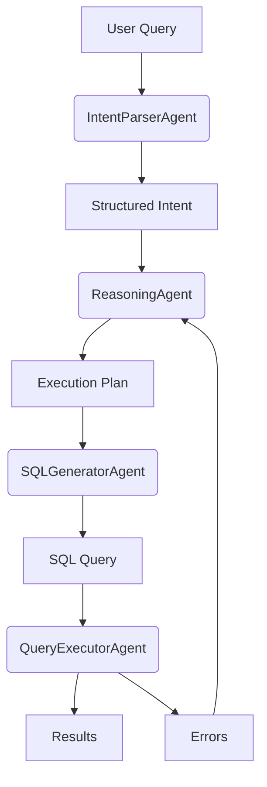

# SQL Assistant Development Journal

## Project Overview
**Date**: August 3, 2025  
**Version**: 1.0  
**Objective**: Build an AI agentic system that converts natural language queries into executable SQL with robust error handling.

### Key Features Implemented:
- Natural language → SQL intent parsing
- Schema-aware SQL generation
- Query execution with retry logic
- Error classification & recovery
- Multi-agent coordination (ReasoningAgent)

---

## Technical Architecture


### Core Components:
1. **IntentParserAgent**: Uses LLM (GPT-3.5) to extract structured intent
2. **SQLGeneratorAgent**: Converts intent → SQL with schema context
3. **QueryExecutorAgent**: Executes SQL with error recovery
4. **ReasoningAgent**: Orchestrates workflow & handles errors

---

## Implementation Details

### Key Technical Choices:
- **LangChain Tools**: Used `@tool` decorators for agent integration
- **Pydantic Models**: Structured data validation (SQLIntent, ExecutionError)
- **Tenacity**: Retry logic for transient database errors
- **Dual-Path Error Handling**:
  - Schema errors → Regenerate SQL
  - Connection errors → Retry with backoff

### Database Integration:
- SQLite (`data/db.sqlite`)
- Schema loading via `utils/file_converter.py`

---

## FAQ: Technical Issues & Solutions

### 1. `ImportError: cannot import name 'QueryExecutorAgent'`
- **Bug**: Missing `__init__.py` exports
- **Fix**: Added `from .agent import QueryExecutorAgent` and `__all__`

### 2. `ModuleNotFoundError: No module named 'agents'`
- **Bug**: Python path not including project root
- **Fix**: Added `sys.path.append(os.path.dirname(...))` in test files

### 3. `ToolException: Database not found`
- **Bug**: Relative path resolution in tools
- **Fix**: Used `os.path.abspath("data/db.sqlite")`

### 4. `TypeError: unsupported operand type(s) for |`
- **Bug**: Python 3.9 incompatible union syntax
- **Fix**: Changed `int | None` → `Optional[int]`

### 5. `zsh: command not found: pip`
- **Bug**: PATH configuration issue
- **Fix**: Used `pip3` and verified Python environment

---

## How to Run
```bash
# 1. Install dependencies
pip3 install -r requirements.txt

# 2. Set OpenAI key
echo "OPENAI_API_KEY=your_key" > .env

# 3. Run test workflow
python3 main.py
```

---

## Lessons Learned
1. **Path Handling**: Always use absolute paths in agent tools
2. **Error Classification**: Critical for recovery strategies
3. **LLM Context**: Detailed schema improves SQL accuracy
4. **Tool Isolation**: Each agent should handle one responsibility

---

## Future Roadmap
1. Add JOIN/CTE support in SQLGenerator
2. Implement ResultFormatterAgent
3. Build Gradio web interface
4. Add performance monitoring

---

*Last Updated: August 3, 2025* 