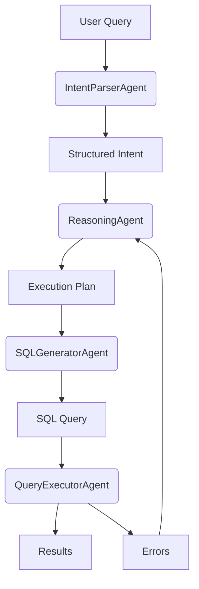
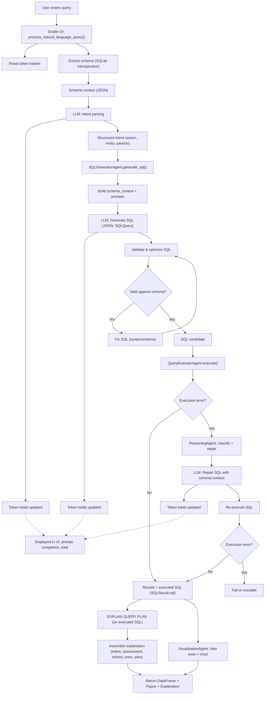

# SQL Assistant Development Journal

## Project Overview
**Date**: August 3, 2025  
**Version**: 1.0  
**Objective**: Build an AI agentic system that converts natural language queries into executable SQL with robust error handling.

### Key Features Implemented:
- Natural language → SQL intent parsing
- Schema-aware SQL generation
- Query execution with retry logic
- Error classification & recovery
- Multi-agent coordination (ReasoningAgent)

---

## Technical Architecture


### Core Components:
1. **IntentParserAgent**: Uses LLM (GPT-3.5) to extract structured intent
2. **SQLGeneratorAgent**: Converts intent → SQL with schema context
3. **QueryExecutorAgent**: Executes SQL with error recovery
4. **ReasoningAgent**: Orchestrates workflow & handles errors

---

## Implementation Details

### Key Technical Choices:
- **LangChain Tools**: Used `@tool` decorators for agent integration
- **Pydantic Models**: Structured data validation (SQLIntent, ExecutionError)
- **Tenacity**: Retry logic for transient database errors
- **Dual-Path Error Handling**:
  - Schema errors → Regenerate SQL
  - Connection errors → Retry with backoff

### Database Integration:
- SQLite (`data/db.sqlite`)
- Schema loading via `utils/file_converter.py`

---

## FAQ: Technical Issues & Solutions

### 1. `ImportError: cannot import name 'QueryExecutorAgent'`
- **Bug**: Missing `__init__.py` exports
- **Fix**: Added `from .agent import QueryExecutorAgent` and `__all__`

### 2. `ModuleNotFoundError: No module named 'agents'`
- **Bug**: Python path not including project root
- **Fix**: Added `sys.path.append(os.path.dirname(...))` in test files

### 3. `ToolException: Database not found`
- **Bug**: Relative path resolution in tools
- **Fix**: Used `os.path.abspath("data/db.sqlite")`

### 4. `TypeError: unsupported operand type(s) for |`
- **Bug**: Python 3.9 incompatible union syntax
- **Fix**: Changed `int | None` → `Optional[int]`

### 5. `zsh: command not found: pip`
- **Bug**: PATH configuration issue
- **Fix**: Used `pip3` and verified Python environment

---

## How to Run
```bash
# 1. Install dependencies
pip3 install -r requirements.txt

# 2. Set OpenAI key
echo "OPENAI_API_KEY=your_key" > .env

# 3. Run test workflow
python3 main.py
```

---

## Lessons Learned
1. **Path Handling**: Always use absolute paths in agent tools
2. **Error Classification**: Critical for recovery strategies
3. **LLM Context**: Detailed schema improves SQL accuracy
4. **Tool Isolation**: Each agent should handle one responsibility

---

## Major Enhancement: Complex Query Pattern Recognition (August 19, 2025)

### **Challenge Identified:**
The original IntentParserAgent could only handle simple aggregations but failed on complex queries requiring window functions, particularly "Top N per group" patterns.

**Example failing query:** *"Which customer had the most bookings for Intersight Advantage in each year?"*

**Original intent generated:**
```json
{
  "action": "aggregate",
  "params": {
    "column": "ACTUAL_BOOKINGS", 
    "function": "SUM",
    "group_by": ["YEAR"],  // Missing customer dimension
    "filters": [{"column": "IntersightConsumption", "value": "pApp"}]
  }
}
```

**Problems:**
1. **Missing customer identification** - couldn't find "top customer"
2. **No ranking logic** - missed "most bookings" requirement  
3. **Simple aggregation** - treated as basic GROUP BY instead of window function
4. **Incomplete partitioning** - grouped by year but missed per-year ranking

### **Solution Implemented:**

#### **1. Enhanced Pattern Detection**
- **Ranking patterns**: `top|best|highest|most` with direction detection
- **Per-group patterns**: `for each|in each|per|by` with partition detection
- **Complex indicators**: Combined ranking + grouping = window function needed

#### **2. Query Complexity Classification**
```python
def _classify_query_complexity():
    if ranking_mentions and per_group_mentions:
        return "ranked_aggregation"  # Window function needed
    elif ranking_mentions:
        return "simple_ranking"       # ORDER BY + LIMIT
    elif per_group_mentions:
        return "grouped_aggregation"  # GROUP BY only
    else:
        return "simple_aggregation"   # Basic SUM/COUNT
```

#### **3. Window Function Parameter Building**
For `ranked_aggregation` queries, the system now generates:
```json
{
  "action": "ranked_aggregation",
  "params": {
    "post_aggregation": {
      "top_n_per_group": {
        "partition_by": ["YEAR"],           // Window PARTITION BY
        "order_by": "ACTUAL_BOOKINGS",     // Window ORDER BY
        "desc": true,                      // DESC for "most"
        "n": 1,                           // TOP 1
        "include_ties": true              // Handle ties
      }
    }
  }
}
```

#### **4. Natural Language → Column Mapping**
Added intelligent hint mapping:
- `"year"` → `"YEAR"`
- `"customer"` → `"CUSTOMER_NAME"`
- `"bookings"` → `"ACTUAL_BOOKINGS"`
- `"tier"` → `"IntersightLicenseTier"`

### **Key Technical Concepts:**

#### **Window Functions vs Simple Aggregation**
- **Simple**: `GROUP BY year` → one result per year
- **Window**: `PARTITION BY year ORDER BY bookings` → ranked results within each year

#### **Pattern Recognition Pipeline**
1. **Lexical Analysis**: Detect ranking and grouping keywords
2. **Complexity Classification**: Determine query type based on patterns
3. **Parameter Extraction**: Build window function specifications
4. **Column Mapping**: Resolve natural language to schema columns

#### **Enhanced Mention Detection**
```python
# Before: Basic keyword detection
mentions = ["top", "year"]

# After: Structured pattern extraction
mentions = [
  {"type": "rank", "direction": "DESC", "n": 1},
  {"type": "per_group", "group_hint": "year", "mapped_column": "YEAR"}
]
```

### **Impact:**
- **✅ Window Function Support**: Handles complex "Top N per group" queries
- **✅ Better Intent Classification**: Distinguishes ranking vs aggregation
- **✅ Accurate Column Mapping**: Resolves natural language to schema
- **✅ Backward Compatibility**: Simple queries still work as before

### **Testing Results:**
Query: *"Which customer had the most bookings for Intersight Advantage in each year?"*
- **Before**: Simple aggregation, missing customer identification
- **After**: Proper window function with partitioning and ranking

---

## Future Roadmap
1. Add JOIN/CTE support in SQLGenerator  
2. Implement ResultFormatterAgent
3. Build Gradio web interface
4. Add performance monitoring
5. **✅ Complex Query Pattern Recognition** - COMPLETED

---

## End-to-End Flow: User Query Lifecycle


---

## Development Sessions

### Session 8: Semantic Schema Integration & Intent Parser Fixes
**Date**: August 19, 2025  
**Focus**: Fixing semantic schema integration and LLM intent parsing

#### 1. Problem Identified
- **Root Issue**: Intent Parser was not utilizing semantic schema context despite semantic schema files existing
- **Symptoms**: 
  - LLM incorrectly mapping "SaaS" to `IntersightProduct` instead of `IntersightConsumption`
  - Semantic context was loaded but ignored by the Intent Parser
  - System prompt was static and didn't leverage business context

#### 2. Solution Implementation

**Phase 1: Schema Flow Investigation**
- Traced schema_info → schema_manifest → context flow
- Discovered `adapt_schema_for_llm()` was stripping semantic context
- Found that semantic context existed in `schema_info["semantic_context"]` but wasn't preserved

**Phase 2: Fix Schema Propagation**
```python
# Fixed adapt_schema_for_llm to preserve semantic context
@staticmethod
def adapt_schema_for_llm(schema_info: Dict[str, Any]) -> Dict[str, Any]:
    # ... existing table processing ...
    result = {"tables": tables}
    
    # Include semantic context if available
    if "semantic_context" in schema_info:
        result["semantic_context"] = schema_info["semantic_context"]
        
    return result
```

**Phase 3: Architecture Simplification**
- Initially attempted to duplicate semantic info in system prompt (overcomplicated)
- **Key Insight**: Semantic context already flows through context object to LLM
- Removed unnecessary duplication and kept clean single-source-of-truth approach

#### 3. Technical Concepts & Techniques Used

**Semantic Schema Architecture**:
- `SemanticSchemaManager`: Business context layer over raw database schema
- Column semantics with `sample_values`, `business_meaning`, `description`
- Enhanced schema context: `schema_info` → `schema_manifest` → `context` → LLM

**LLM Integration Patterns**:
- **System Prompt**: Static instructions and rules
- **Context Object**: Dynamic, structured data including semantic schema
- **Single Source of Truth**: Avoid duplication between prompt and context

**Data Flow Debugging**:
- Added comprehensive logging to trace schema_info content
- Used debug logging to verify semantic context propagation
- Tested end-to-end flow from database → semantic schema → LLM

#### 4. Key Learning Points

**Architecture Design**:
- **Don't duplicate data**: Semantic context should flow through one clean path
- **Separate concerns**: System prompt for instructions, context for data
- **Structured over narrative**: LLM processes JSON context better than prose descriptions

**Debugging Complex Systems**:
- **Trace data flow**: Follow data transformation through each layer
- **Add strategic logging**: Debug at key transformation points
- **Test incrementally**: Verify each fix before adding complexity

**LLM Integration Best Practices**:
- **Context over prompt**: Rich structured data in user message context
- **Minimal prompt duplication**: Keep system prompt focused on instructions
- **Schema-aware design**: Leverage semantic business context for better mappings

**Column Mapping Challenge**:
- Raw schema alone insufficient for categorical value mapping
- Semantic schema with `sample_values` critical for "SaaS" → `IntersightConsumption`
- Business context improves LLM understanding beyond technical column names

#### 5. Files Modified
- `agents/intent_parser/agent.py`: Fixed schema propagation and simplified architecture
- `agents/schema_loader/config/semantic_schemas/raw_data_semantic.json`: Enhanced with categorical mappings

#### 6. Impact
- ✅ Semantic context now properly flows to Intent Parser
- ✅ LLM has access to business meanings and sample values
- ✅ Cleaner architecture without unnecessary duplication
- ✅ Better column mapping for categorical queries ("SaaS", "vApp", etc.)

---

*Last Updated: August 19, 2025* 