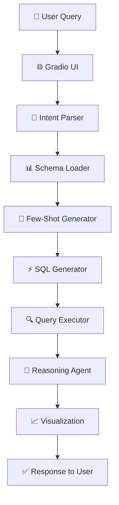

# SQL_Assistant_2: Project Structure & Information Flow

## 📁 Project Tree Structure

```
SQL_Assistant_2/
├── agents/                              # Multi-agent AI system
│   ├── chart_generator/                 # (Future) Chart generation
│   ├── coordinator/                     # (Future) Agent coordination
│   ├── intent_parser/                   # Natural language intent parsing
│   │   ├── __init__.py
│   │   └── agent.py                     # IntentParserAgent
│   ├── query_executor/                  # SQL execution & validation
│   │   ├── __init__.py
│   │   └── agent.py                     # QueryExecutorAgent
│   ├── reasoning_agent/                 # Query analysis & correction
│   │   ├── __init__.py
│   │   ├── agent.py                     # ReasoningAgent
│   │   ├── config.py
│   │   └── schemas.py
│   ├── schema_loader/                   # (Future) Dynamic schema loading
│   ├── shared/                          # Shared utilities
│   │   ├── __init__.py
│   │   ├── retry.py                     # Retry mechanisms
│   │   └── schemas.py                   # Common data models
│   ├── sql_generator/                   # 🚀 Core SQL generation
│   │   ├── __init__.py
│   │   ├── agent.py                     # SQLGeneratorAgent (GPT-3.5)
│   │   ├── config.py
│   │   ├── few_shot_generator.py        # 🎯 Few-shot examples (GPT-4o-mini)
│   │   ├── schemas.py                   # SQL query models
│   │   └── test_sql_generator.py
│   ├── visualization/                   # Data visualization
│   │   └── agent.py                     # VisualizationAgent
│   ├── __init__.py
│   └── workflow.py                      # 🔄 Main workflow orchestration
├── config/                              # Configuration files
├── data/                                # Data storage
│   ├── few_shot_examples/               # 🧠 Generated SQL examples
│   │   ├── examples_1912b25c.json      # Intent-aware examples
│   │   └── examples_cf08259c.json      # General examples
│   ├── db.sqlite                        # Test database
│   ├── product_sales_dataset.csv       # Raw data
│   └── product_sales.db                 # Main SQLite database
├── docs/                                # Documentation
├── Server/                              # Server components
│   └── src/core/
│       └── intent_parser_tool.py        # Server-side intent parsing
├── shared/                              # Shared resources
├── tests/                               # Unit tests
│   └── test_visualization.py
├── utils/                               # Utility modules
│   ├── __init__.py
│   ├── file_converter.py                # File conversion utilities
│   └── token_tracker.py                 # 📊 OpenAI token tracking
├── gradio_ui.py                         # 🌐 Main web interface
├── main.py                              # CLI entry point
├── requirements.txt                     # Python dependencies
└── [Documentation Files]               # Various MD files
```

## 🔄 Information Flow: User Query → SQL Generation

### Overview


### Detailed Step-by-Step Flow

#### 1. 🌐 **User Interface Layer** (`gradio_ui.py`)
```python
# Entry point: process_natural_language_query()
User Input: "Show me revenue by region"
Chart Type: "bar"
```
**Actions:**
- Receives natural language query
- Initializes token tracker
- Sets up AI workflow components

#### 2. 🧠 **Intent Parsing** (`agents/intent_parser/agent.py` + `gradio_ui.py`)
```python
# Function: parse_natural_language_to_intent()
Input: "Show me revenue by region"
Output: {
    "action": "aggregate",
    "entity": "product_sales", 
    "params": {
        "column": "total_price",
        "function": "sum",
        "group_by": "region",
        "order_by": null,
        "filters": []
    }
}
```
**Technologies:**
- **OpenAI GPT-3.5-turbo** for intent parsing
- Schema-aware prompting
- Fallback mechanisms for API failures

#### 3. 📊 **Schema Loading** (`gradio_ui.py::get_formatted_schema()`)
```python
# Database introspection
Schema Output: {
    "tables": {
        "product_sales": {
            "columns": [
                {"name": "total_price", "type": "REAL", "primary_key": false},
                {"name": "region", "type": "TEXT", "primary_key": false},
                // ... more columns
            ],
            "indexes": [
                {"name": "idx_region", "columns": ["region"]}
            ]
        }
    }
}
```
**Actions:**
- SQLite `PRAGMA` commands for schema extraction
- Column type and constraint detection
- Index information gathering

#### 4. 🎯 **Few-Shot Example Generation** (`agents/sql_generator/few_shot_generator.py`)
```python
# Class: FewShotExampleGenerator
Input: schema_info + query_intent
Process: GPT-4o-mini generates context-aware examples
Output: Formatted examples for prompt injection

Example Generated:
"Example: Revenue analysis by region
Thinking Process:
  Step 1: Identify revenue column (total_price)
  Step 2: Group by region dimension  
  Step 3: Sum revenue for each region
SQL: SELECT region, SUM(total_price) FROM product_sales GROUP BY region;"
```
**Key Features:**
- **GPT-4o-mini** for cost-effective example generation
- Intent-aware example selection
- Schema-compliant SQL patterns
- Thinking process documentation

#### 5. ⚡ **SQL Generation** (`agents/sql_generator/agent.py`)
```python
# Class: SQLGeneratorAgent
Input: intent_data + schema_info + few_shot_examples
Process: GPT-3.5-turbo with enhanced prompting
Output: SQLQuery object

Generated SQL: 
"SELECT region, SUM(total_price) AS total_revenue 
 FROM product_sales 
 GROUP BY region;"

Confidence: 0.9
Metadata: {"complexity": "medium", "estimated_rows": "low"}
```
**Advanced Features:**
- Dynamic few-shot example injection
- Schema validation and auto-correction
- SQL optimization (ORDER BY for LIMIT, etc.)
- Confidence scoring

#### 6. 🔍 **Query Execution** (`agents/query_executor/agent.py`)
```python
# Class: QueryExecutorAgent
Input: sql_query + database_path
Process: SQLite execution with error handling
Output: ExecutionResult

Result: {
    "data": [
        {"region": "North", "total_revenue": 150000},
        {"region": "South", "total_revenue": 120000},
        // ... more rows
    ],
    "execution_time": 0.023,
    "row_count": 4
}
```
**Error Handling:**
- SQL syntax validation
- Timeout protection
- Resource limit enforcement

#### 7. 🤔 **Reasoning & Correction** (`agents/reasoning_agent/agent.py`)
```python
# Class: ReasoningAgent
Input: execution_result + original_intent
Process: Analysis and potential correction
Output: Enhanced result with explanations

If Error Detected:
- Schema mismatch correction
- SQL syntax fixes  
- Alternative query suggestions
```

#### 8. 📈 **Visualization** (`agents/visualization/agent.py`)
```python
# Class: VisualizationAgent
Input: query_results + chart_type
Process: Dynamic axis inference + Plotly chart generation
Output: Interactive chart

Chart Config: {
    "type": "bar",
    "x_axis": "region", 
    "y_axis": "total_revenue",
    "title": "Revenue by Region"
}
```

#### 9. 📊 **Response Assembly** (`gradio_ui.py`)
```python
# Final assembly in process_natural_language_query()
Components:
- DataFrame: Query results
- Plot: Interactive visualization  
- Explanation: Detailed breakdown

Explanation Includes:
- Intent analysis
- Generated SQL (with corrections if any)
- Model confidence & metadata
- Execution metrics (time, rows, tokens)
- Query plan analysis
```

## 🔧 Key Technical Components

### 🧠 **AI Models Used**
| Component | Model | Purpose |
|-----------|-------|---------|
| Intent Parsing | GPT-3.5-turbo | Natural language → structured intent |
| Few-Shot Generation | GPT-4o-mini | Context-aware SQL examples |
| SQL Generation | GPT-3.5-turbo | Intent + schema → SQL query |

### 📊 **Data Flow Architecture**
```
[User Query] 
    ↓ 
[Intent Parser] → {action, entity, params}
    ↓
[Schema Loader] → {tables, columns, types, indexes}
    ↓
[Few-Shot Generator] → Context-aware examples
    ↓
[SQL Generator] → Validated SQL + metadata
    ↓
[Query Executor] → Result data + performance metrics
    ↓
[Visualization] → Interactive charts
    ↓
[Response] → Complete answer with explanations
```

### 🎯 **Enhanced Features**

#### **Intent-Aware Few-Shot Learning**
- Examples tailored to current query type
- Progressive complexity demonstration
- Schema-compliant patterns

#### **Token Optimization**
- Selective schema context (relevant tables only)
- Cached example generation
- Efficient prompt engineering

#### **Error Recovery**
- Automatic SQL correction
- Schema mismatch detection
- Fallback query generation

#### **Performance Monitoring**
- Token usage tracking
- Execution time measurement
- Confidence scoring

## 🚀 **Execution Flow Summary**

1. **User enters natural language query** in Gradio UI
2. **Intent parser** extracts structured intent using GPT-3.5
3. **Schema loader** provides database structure context
4. **Few-shot generator** creates relevant examples using GPT-4o-mini
5. **SQL generator** produces optimized SQL using GPT-3.5 + examples
6. **Query executor** runs SQL against SQLite database
7. **Reasoning agent** validates and potentially corrects results
8. **Visualization agent** creates interactive charts
9. **Response assembled** with data, charts, and detailed explanations

This architecture ensures **high accuracy**, **cost efficiency**, and **robust error handling** while providing **transparent explanations** of the entire process.
